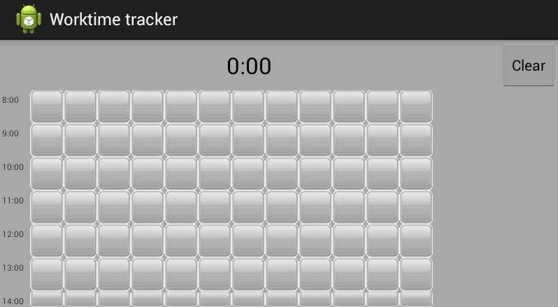

wtracker
========

Small android app for tracking worktime leaks.

Программа для отслеживания времени, потраченного на работу. Рабочий день представлен в виде матрицы кнопок. Каждый ряд в ней отражает один час, разделённый на пятиминутные интервалы. Нажатия позволяют отмечать пятиминутки, в течении которых шла работа. Счётчик показывает суммарное время, потраченное с пользой. 

Зачем? 
------
Потому что трекеры с таймерами, которые надо включать и переключать, не удобны - забыл переключить, и статистика за день испортилась. Я попробовал отмечать время на листочке в клеточку и мне понравилось. Пятиминутной точности достаточно и такой учёт не отнимает много внимания. 

Текущее состояние
---------
Написанный за вечер прототип. Пользуюсь им на работе - удобно, но это ещё не релиз. 
